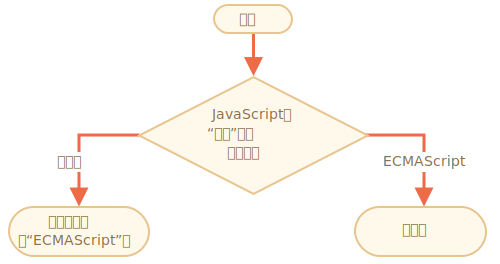

# 条件分支：if 和 '?'

有时我们需要根据不同条件执行不同的操作。

我们可以使用 `if` 语句和条件运算符 `?`（也称为“问号”运算符）来实现。

## "if" 语句

`if(...)` 语句计算括号里的条件表达式，如果计算结果是 `true`，就会执行对应的代码块。

例如：

```js {3-4}
let year = prompt('In which year was ECMAScript-2015 specification published?', '');

if (year == 2015) alert( 'You are right!' );
```

在上面这个例子中，条件是一个简单的相等性检查（`year == 2015`），但它还可以更复杂。

如果有多个语句要执行，我们必须将要执行的代码块封装在大括号内：

```js
if (year == 2015) {
  alert( "That's correct!" );
  alert( "You're so smart!" );
}
```

建议每次使用 if 语句都用大括号 `{}` 来包装代码块，即使只有一条语句。这样可以提高代码可读性。

## 布尔转换

`if (…)` 语句会计算圆括号内的表达式，并将计算结果转换为布尔型。

让我们回顾一下 [类型转换](/type-conversions) 一章中的转换规则：

- 数字 `0`、空字符串 `""`、`null`、`undefined` 和 `NaN` 都会被转换成 `false`。因为它们被称为 "falsy" 值。
- 其他值被转换为 `true`，所以它们被称为 "truthy"。

所以，下面这个条件下的代码永远不会执行：

```js
if (0) { // 0 是 falsy
  ...
}
```

……但下面的条件 —— 始终有效：

```js
if (1) { // 1 是 truthy
  ...
}
```

我们也可以将未计算的布尔值传入 `if` 语句，像这样：

```js
let cond = (year == 2015); // 相等运算符的结果是 true 或 false

if (cond) {
  ...
}
```

## "else" 语句

`if` 语句有时会包含一个可选的 "else" 块。如果判断条件不成立，就会执行它内部的代码。

例如：

```js
let year = prompt('In which year was ECMAScript-2015 specification published?', '');

if (year == 2015) {
  alert( 'You guessed it right!' );
} else {
  alert( 'How can you be so wrong?' ); // 2015 以外的任何值
}
```

## 多个条件："else if"

有时我们需要测试一个条件的几个变体。我们可以通过使用 `else if` 子句实现。

例如：

```js
let year = prompt('In which year was ECMAScript-2015 specification published?', '');

if (year < 2015) {
  alert( 'Too early...' );
} else if (year > 2015) {
  alert( 'Too late' );
} else {
  alert( 'Exactly!' );
}
```

在上面的代码中，JavaScript 先先检查 `year < 2015`。如果条件不符合，就会转到下一个条件 `year > 2015`。如果这个条件也不符合，则会显示最后一个 `alert`。

可以有更多的 `else if` 块。结尾的 `else` 是可选的。

## 条件运算符 '?'

有时我们需要根据一个条件去赋值一个变量。

如下所示：

```js {4-8}
let accessAllowed;
let age = prompt('How old are you?', '');

if (age > 18) {
  accessAllowed = true;
} else {
  accessAllowed = false;
}

alert(accessAllowed);
```

所谓的“条件”或“问号”运算符让我们可以更简短地达到目的。

这个运算符通过问号 `?` 表示。有时它被称为三元运算符，被称为“三元”是因为该运算符中有三个操作数。实际上它是 JavaScript 中唯一一个有这么多操作数的运算符。

语法：

```js
let result = condition ? value1 : value2;
```

计算条件结果，如果结果为真，则返回 `value1`，否则返回 `value2`。

例如：

```js
let accessAllowed = (age > 18) ? true : false;
```

技术上讲，我们可以省略 `age > 18` 外面的括号。问号运算符的优先级较低，所以它会在比较运算符 `>` 后执行。

下面这个示例会执行和前面那个示例相同的操作：

```js
// 比较运算符 "age > 18" 首先执行
//（不需要将其包含在括号中）
let accessAllowed = age > 18 ? true : false;
```

但括号可以使代码可读性更强，所以我们建议使用它们。

::: tip 请注意

在上面的例子中，你可以不使用问号运算符，因为比较本身就返回 `true/false`：

```js
// 下面代码同样可以实现
let accessAllowed = age > 18;
```

:::

## 多个 '?'

使用一系列问号 `?` 运算符可以返回一个取决于多个条件的值。

例如：

```js
let age = prompt('age?', 18);

let message = (age < 3) ? 'Hi, baby!' :
  (age < 18) ? 'Hello!' :
  (age < 100) ? 'Greetings!' :
  'What an unusual age!';

alert( message );
```

可能很难一下子看出发生了什么。但经过仔细观察，我们可以看到它只是一个普通的检查序列。

1. 第一个问号检查 `age < 3`。
2. 如果为真 — 返回 `'Hi, baby!'`。否则，会继续执行冒号 `":"` 后的表达式，检查 `age < 18`。
3. 如果为真 — 返回 `'Hello!'`。否则，会继续执行下一个冒号 `":"` 后的表达式，检查 `age < 100`。
4. 如果为真 — 返回 `'Greetings!'`。否则，会继续执行最后一个冒号 `":"` 后面的表达式，返回 `'What an unusual age!'`。

这是使用 `if..else` 实现上面的逻辑的写法：

```js
if (age < 3) {
  message = 'Hi, baby!';
} else if (age < 18) {
  message = 'Hello!';
} else if (age < 100) {
  message = 'Greetings!';
} else {
  message = 'What an unusual age!';
}
```

## '?' 的非常规使用

有时可以使用问号 `?` 来代替 `if` 语句：

```js {3-5}
let company = prompt('Which company created JavaScript?', '');

(company == 'Netscape') ?
   alert('Right!') : alert('Wrong.');
```

根据条件 `company =='Netscape'`，要么执行 `?` 后面的第一个表达式并显示对应内容，要么执行第二个表达式并显示对应内容。

在这里我们不是把结果赋值给变量。而是根据条件执行不同的代码。

**不建议这样使用问号运算符。**

这种写法比 `if` 语句更短，对一些程序员很有吸引力。但它的可读性差。

下面是使用 `if` 语句实现相同功能的代码，进行下比较：

```js {3-7}
let company = prompt('Which company created JavaScript?', '');

if (company == 'Netscape') {
  alert('Right!');
} else {
  alert('Wrong.');
}
```

因为我们的眼睛垂直扫描代码。所以，跨越几行的代码块比长而水平的代码更易于理解。

问号 `?` 的作用是根据条件返回一个或另一个值。请正确使用它。当需要执行不同的代码分支时，请使用 `if`。


## 任务

<https://zh.javascript.info/ifelse#tasks>

### if (值为 0 的字符串)

`alert` 弹窗会出来吗？

```js
if ("0") {
  alert( 'Hello' );
}
```

**是的，它会**

任何非空字符串（`"0"` 不是空字符串）的逻辑值都是 `true`。

### JavaScript 的名字

使用 `if..else` 结构，实现提问 "What is the "official" name of JavaScript?" 的代码

如果访问者输入了 "ECMAScript"，输出就提示 "Right!"，否则 — 输出："Didn't know? ECMAScript!"



答案如下：

```html
<!DOCTYPE html>
<html>
<body>
  <script>
    'use strict';

    let value = prompt('What is the "official" name of JavaScript?', '');

    if (value == 'ECMAScript') {
      alert('Right!');
    } else {
      alert("You don't know? ECMAScript!");
    }
  </script>
</body>
</html>
```

### 显示符号

使用 `if..else` 语句，编写代码实现通过 `prompt` 获取一个数字并用 `alert` 显示结果：

- 如果这个数字大于 0，就显示 `1`，
- 如果这个数字小于 0，就显示 `-1`，
- 如果这个数字等于 0，就显示 `0`。

在这个任务中，我们假设输入永远是一个数字。

答案如下：

```html
<!DOCTYPE html>
<html>
<body>
  <script>
    'use strict';
    let value = prompt('Type a number', 0);
    if (value > 0) {
      alert(1);
    } else if (value < 0) {
      alert(-1);
    } else {
      alert(0);
    }
  </script>
</body>
</html>
```

### 使用 '?' 重写 'if' 语句

使用条件运算符 `'?'` 重写下面的 `if` 语句：

```js
let result;

if (a + b < 4) {
  result = 'Below';
} else {
  result = 'Over';
}
```

答案如下：

```js
result = (a + b < 4) ? 'Below' : 'Over';
```

### 使用 '?' 重写 'if..else' 语句

使用多个三元运算符 `'?'` 重写下面的 `if..else` 语句。

为了增强代码可读性，建议将代码分成多行。

```js
let message;

if (login == 'Employee') {
  message = 'Hello';
} else if (login == 'Director') {
  message = 'Greetings';
} else if (login == '') {
  message = 'No login';
} else {
  message = '';
}
```

答案如下：

```js
let message = (login == 'Employee') ? 'Hello' :
  (login == 'Director') ? 'Greetings' :
  (login == '') ? 'No login' :
  '';
```