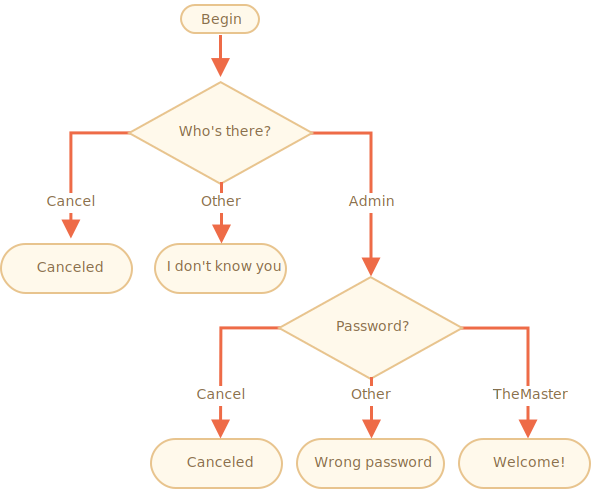

# 逻辑运算符

JavaScript 里有三个逻辑运算符：`||`（或），`&&`（与），`!`（非）。

虽然它们被称为“逻辑”运算符，但这些运算符却可以被应用于任意类型的值，而不仅仅是布尔值。它们的结果也同样可以是任意类型。

让我们来详细看一下。

## ||（或）

两个竖线符号表示了“或”运算：

```js
result = a || b;
```

在传统的编程中，逻辑或仅能够操作布尔值。如果参与运算的任意一个参数为 `true`，返回的结果就为 `true`，否则返回 `false`。

在 JavaScript 中，逻辑运算符更加灵活强大。但是首先我们看一下操作数是布尔值的时候发生了什么。

下面是四种可能的逻辑组合：

```js
alert( true || true );   // true
alert( false || true );  // true
alert( true || false );  // true
alert( false || false ); // false
```

正如我们所见，除了两个操作数都是 `false` 的情况，结果都是 `true`。

如果操作数不是布尔值，那么它将会被转化为布尔值来参与运算。

例如，数字 `1` 将会被作为 `true`，数字 `0` 则作为 `false`：

```js
if (1 || 0) { // 工作原理相当于 if( true || false )
  alert( 'truthy!' );
}
```

大多数情况，逻辑或 `||` 会被用在 `if` 语句中，用来测试是否有 **任何** 给定的条件为 `true`。

例如：

```js {3-5}
let hour = 9;

if (hour < 10 || hour > 18) {
  alert( 'The office is closed.' );
}
```

我们可以传入更多的条件：

```js
let hour = 12;
let isWeekend = true;

if (hour < 10 || hour > 18 || isWeekend) {
  alert( 'The office is closed.' ); // 是周末
}
```

## 或运算寻找第一个真值

上文提到的逻辑处理多少有些传统了。下面让我们看看 JavaScript 的“附加”特性。

拓展的算法如下所示。

给定多个参与或运算的值：

```js
result = value1 || value2 || value3;
```

或运算符 `||` 做了如下的事情：

- 从左到右依次计算操作数。
- 处理每一个操作数时，都将其转化为布尔值。如果结果是 `true`，就停止计算，返回这个操作数的初始值。
- 如果所有的操作数都被计算过（也就是，转换结果都是 `false`），则返回最后一个操作数。

返回的值是操作数的初始形式，不会做布尔转换。

也就是，一个或运算 `"||"` 的链，将返回第一个真值，如果不存在真值，就返回该链的最后一个值。

例如：

```js
alert( 1 || 0 ); // 1（1 是真值）

alert( null || 1 ); // 1（1 是第一个真值）
alert( null || 0 || 1 ); // 1（第一个真值）

alert( undefined || null || 0 ); // 0（所有的转化结果都是 false，返回最后一个值）
```

与“纯粹的、传统的、仅仅处理布尔值的或运算”相比，这个规则就引起了一些很有趣的用法。

1. **获取变量列表或者表达式的第一个真值。**

    例如，我们有 `firstName`、`lastName` 和 `nickName` 变量，都是可选的。

    我们用或运算 `||` 来选择有值的那一个，并显示出来（如果没有设置，则用 `匿名（anonymous）`）：

    ```js {5}
    let firstName = "";
    let lastName = "";
    let nickName = "SuperCoder";

    alert( firstName || lastName || nickName || "Anonymous"); // SuperCoder
    ```

    如果所有变量都为假（falsy)，结果就是 `Anonymous`。

2. **短路求值（Short-circuit evaluation）。**

    或运算符 `||` 的另一个特点是所谓的“短路求值”。

    它的意思是，`||` 对其参数进行处理，直到达到第一个真值，然后立即返回该值，而无需处理其他参数。

    如果操作数不仅仅是一个值，而是一个有副作用的表达式，例如变量赋值或函数调用，那么这一特性的重要性就变得显而易见了。

    在下面这个例子中，只会打印第二条信息：

    ```js {1-2}
    true || alert("not printed");
    false || alert("printed");
    ```

    在第一行中，或运算符 `||` 在遇到 `true` 时立即停止运算，所以 `alert` 没有运行。

    有时，人们利用这个特性，只在左侧的条件为假时才执行命令。

## &&（与）

两个 & 符号表示 `&&` 与操作：

```js
result = a && b;
```

传统的编程中，当两个操作数都是真值，与操作返回 `true`，否则返回 `false`：

```js
alert( true && true );   // true
alert( false && true );  // false
alert( true && false );  // false
alert( false && false ); // false
```

使用 `if` 语句的例子：

```js
let hour = 12;
let minute = 30;

if (hour == 12 && minute == 30) {
  alert( 'Time is 12:30' );
}
```

就像或运算一样，与运算的操作数可以是任意类型的值：

```js
if (1 && 0) { // 作为 true && false 来执行
  alert( "won't work, because the result is falsy" );
}
```

## 与操作寻找第一个假值

给出多个参加与运算的值：

```js
result = value1 && value2 && value3;
```

与运算 `&&` 做了如下的事：

- 从左到右依次计算操作数。
- 将处理每一个操作数时，都将其转化为布尔值。如果结果是 `false`，就停止计算，并返回这个操作数的初始值。
- 如果所有的操作数都被计算过（也就是，转换结果都是 `true`），则返回最后一个操作数。

换句话说，与运算符返回第一个假值，如果没有假值就返回最后一个值。

上面的规则和或运算很像。区别就是与运算返回第一个假值而或操作返回第一个真值。

例如：

```js
// 如果第一个运算符是真值，
// 与操作返回第二个操作数：
alert( 1 && 0 ); // 0
alert( 1 && 5 ); // 5

// 如果第一个运算符是假值，
// 与操作直接返回它。第二个操作数被忽略
alert( null && 5 ); // null
alert( 0 && "no matter what" ); // 0
```

我们也可以在一行代码上串联多个值。查看第一个假值是否被返回：

```js
alert( 1 && 2 && null && 3 ); // null
```

如果所有的值都是真值，最后一个值将会被返回：

```js
alert( 1 && 2 && 3 ); // 3，最后一个值
```

::: tip 与运算符 && 在或运算符 || 之前执行

与运算 `&&` 的优先级比或运算 `||` 要高。

所以代码 `a && b || c && d` 完全跟 `&&` 表达式加了括号一样：`(a && b) || (c && d)`。

:::

::: warning 不要用 || 或 && 来取代 if

有时候，有人会用与运算符 `&&` 来“简化 `if`”。

例如：

```js
let x = 1;

(x > 0) && alert( 'Greater than zero!' );
```

`&&` 右边的代码只有运算抵达到那里才能被执行。也就是，当且仅当 `(x > 0)` 返回了真值。

所以我们基本可以类似地得到：

```js
let x = 1;

if (x > 0) alert( 'Greater than zero!' );
```

虽然使用 `&&` 写出的变体看起来更短，但 `if` 更明显，并且往往更具可读性。因此，我们建议根据每个语法结构的用途来使用：如果我们想要 `if`，就使用 `if`；如果我们想要逻辑与，就使用 `&&`。

:::

## !（非）

感叹符号 `!` 表示布尔非运算。

语法相当简单：

```js
result = !value;
```

运算符接受一个参数，并按如下运作：

1. 将操作数转化为布尔类型：`true/false`。
2. 返回相反的值。

例如：

```js
alert( !true ); // false
alert( !0 ); // true
```

两个非运算 `!!` 有时候用来将某个值转化为布尔类型：

```js
alert( !!"non-empty string" ); // true
alert( !!null ); // false
```

也就是，第一个非运算将该值转化为布尔类型并取反，第二个非运算再次取反。最后我们就得到了一个任意值到布尔值的转化。

有更多详细的方法可以完成同样的事 —— 一个内置的 `Boolean` 函数：

```js
alert( Boolean("non-empty string") ); // true
alert( Boolean(null) ); // false
```

非运算符 `!` 的优先级在所有逻辑运算符里面最高，所以它总是在 `&&` 和 `||` 前执行。

## 任务

<https://zh.javascript.info/logical-operators#tasks>

### 或运算的结果是什么？

如下代码将会输出什么？

```js
alert( null || 2 || undefined );
```

结果是 `2`，这是第一个真值。

### 或运算和 alerts 的结果是什么？

下面的代码将会输出什么？

```js
alert( alert(1) || 2 || alert(3) );
```

答案：首先是 `1`，然后是 `2`。

对 `alert` 的调用没有返回值。或者说返回的是 `undefined`。

1. 第一个或运算 `||` 对它的左值 `alert(1)` 进行了计算。这就显示了第一条信息 `1`。
2. 函数 `alert` 返回了 `undefined`，所以或运算继续检查第二个操作数以寻找真值。
3. 第二个操作数 `2` 是真值，所以执行就中断了。`2` 被返回，并且被外层的 alert 显示。

这里不会显示 `3`，因为运算没有抵达 `alert(3)`。

### 与操作的结果是什么？

下面这段代码将会显示什么？

```js
alert( 1 && null && 2 );
```

答案：`null`，因为它是列表中第一个假值。

### 与运算连接的 alerts 的结果是什么？

这段代码将会显示什么？

```js
alert( alert(1) && alert(2) );
```

答案：`1`，然后 `undefined`。

调用 `alert` 返回了 `undefined`（它只展示消息，所以没有有意义的返回值）。

因此，`&&` 计算了它左边的操作数（显示 `1`），然后立即停止了，因为 `undefined` 是一个假值。`&&` 就是寻找假值然后返回它，所以运算结束。

### 或运算、与运算、或运算串联的结果

结果将会是什么？

```js
alert( null || 2 && 3 || 4 );
```

答案：`3`。

与运算 `&&` 的优先级比 `||` 高，所以它第一个被执行。

结果是 `2 && 3 = 3`，所以表达式变成了：

```
null || 3 || 4
```

现在的结果就是第一个真值：`3`。

### 检查值是否位于范围区间内

写一个“if”条件句来检查 `age` 是否位于 `14` 到 `90` 的闭区间。

“闭区间”意味着，`age` 的值可以取 `14` 或 `90`。

```js
if (age >= 14 && age <= 90)
```

### 检测值是否位于范围之外

写一个 `if` 条件句，检查 `age` 是否不位于 14 到 90 的闭区间。

创建两个表达式：第一个用非运算 `!`，第二个不用。

第一个表达式：

```js
if (!(age >= 14 && age <= 90))
```

第二个表达式：

```js
if (age < 14 || age > 90)
```

### 一个关于 "if" 的问题

下面哪一个 `alert` 将会被执行？

`if(...)` 语句内表达式的结果是什么？

```js
if (-1 || 0) alert( 'first' );
if (-1 && 0) alert( 'second' );
if (null || -1 && 1) alert( 'third' );
```

答案：第一个和第三个将会被执行。

详解：

```js
// 执行。
// -1 || 0 的结果为 -1，真值
if (-1 || 0) alert( 'first' );

// 不执行。
// -1 && 0 = 0，假值
if (-1 && 0) alert( 'second' );

// 执行
// && 运算的优先级比 || 高
// 所以 -1 && 1 先执行，给出如下运算链：
// null || -1 && 1  ->  null || 1  ->  1
if (null || -1 && 1) alert( 'third' );
```

### 登陆验证

实现使用 `prompt` 进行登陆校验的代码。

如果访问者输入 `"Admin"`，那么使用 `prompt` 引导获取密码，如果输入的用户名为空或者按下了 `key:Esc` 键 —— 显示 "Canceled"，如果是其他字符串 —— 显示 "I don't know you"。

密码的校验规则如下：

- 如果输入的是 "TheMaster"，显示 "Welcome!"，
- 其他字符串 —— 显示 "Wrong password"，
- 空字符串或取消了输入，显示 "Canceled."。

流程图：



请使用嵌套的 `if` 块。注意代码整体的可读性。

提示：将空字符串输入，prompt 会获取到一个空字符串 `''`。Prompt 运行过程中，按下 `key:ESC` 键会得到 `null`。

答案如下：

```js
let userName = prompt("Who's there?", '');

if (userName == 'Admin') {

  let pass = prompt('Password?', '');

  if (pass == 'TheMaster') {
    alert( 'Welcome!' );
  } else if (pass == '' || pass == null) {
    alert( 'Canceled' );
  } else {
    alert( 'Wrong password' );
  }

} else if (userName == '' || userName == null) {
  alert( 'Canceled' );
} else {
  alert( "I don't know you" );
}
```

请注意 `if` 块中水平方向的缩进。技术上是非必需的，但会增加代码的可读性。
