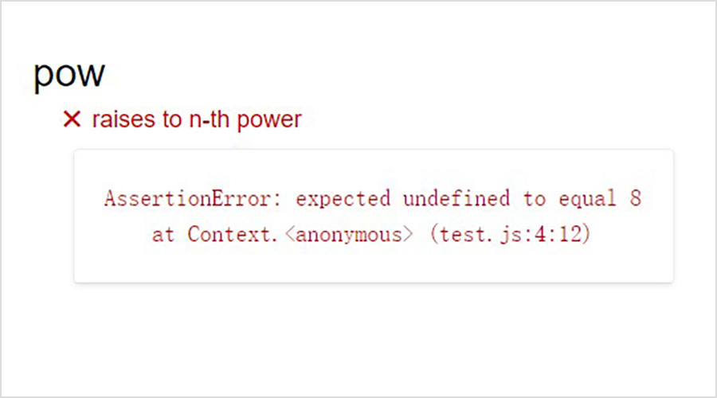
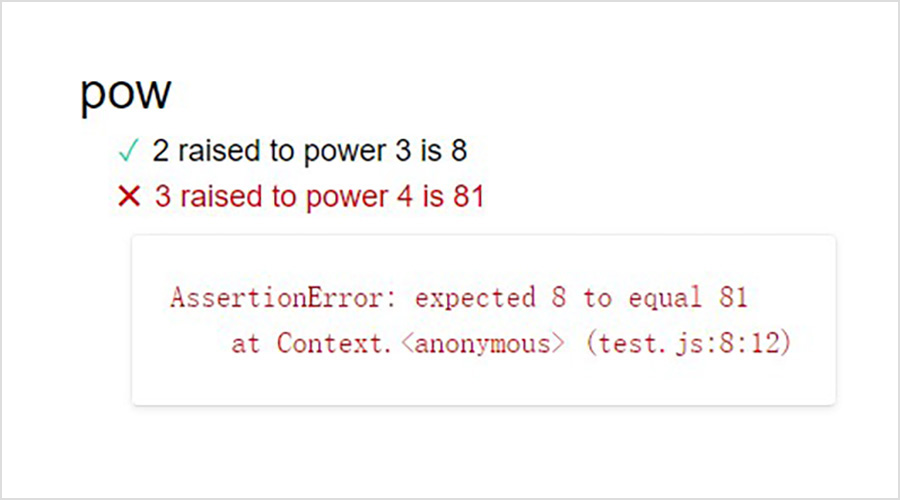
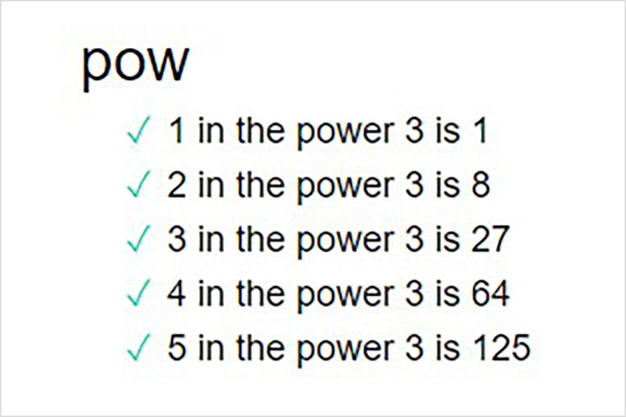
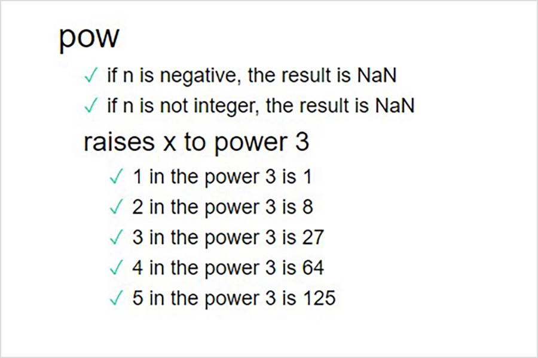

# 使用 Mocha 进行自动化测试

自动化测试将被用于进一步的任务中，并且还将被广泛应用在实际项目中。

## 为什么我们需要测试？

当我们在写一个函数时，我们通常可以想象出它应该做什么：哪些参数会给出哪些结果。

在开发期间，我们可以通过运行程序来检查它并将结果与预期进行比较。例如，我们可以在控制台中这么做。

如果出了问题 —— 那么我们会修复代码，然后再一次运行并检查结果 —— 直到它工作为止。

但这样的手动“重新运行”是不完美的。

**当通过手动重新运行来测试代码时，很容易漏掉一些东西。**

例如，我们要创建一个函数 `f`。写一些代码，然后测试：`f(1)` 可以执行，但是 `f(2)` 不执行。我们修复了一下代码，现在 `f(2)` 可以执行了。看起来已经搞定了？但是我们忘了重新测试 `f(1)`。这样有可能会导致出现错误。

这是非常典型的。当我们在开发一些东西时，我们会保留很多可能需要的用例。但是不要想着程序员在每一次代码修改后都去检查所有的案例。所以这就很容易造成修复了一个问题却造成另一个问题的情况。

**自动化测试意味着测试是独立于代码的。它们以各种方式运行我们的函数，并将结果与预期结果进行比较。**

## 行为驱动开发（BDD）

我们来使用一种名为 [行为驱动开发](http://en.wikipedia.org/wiki/Behavior-driven_development) 或简言为 BDD 的技术。

**BDD 包含了三部分内容：测试、文档和示例。**

为了理解 BDD，我们将研究一个实际的开发案例。

## 开发 “pow”：规范

我们想要创建一个函数 `pow(x, n)` 来计算 `x` 的 `n` 次幂（`n` 为整数）。我们假设 `n≥0`。

这个任务只是一个例子：JavaScript 中有一个 `**` 运算符可以用于幂运算。但是在这里我们专注于可以应用于更复杂任务的开发流程上。

在创建函数 `pow` 的代码之前，我们可以想象函数应该做什么并且描述出来。

这样的描述被称作 **规范（specification, spec）**，包含用例的描述以及针对它们的测试，如下所示：

```js
describe("pow", function() {

  it("raises to n-th power", function() {
    assert.equal(pow(2, 3), 8);
  });

});
```

正如你所看到的，一个规范包含三个主要的模块：

`describe("title", function() { ... })`
: 表示我们正在描述的功能是什么。在我们的例子中我们正在描述函数 `pow`。用于组织“工人（workers）” —— `it` 代码块。

`it("use case description", function() { ... })`
: `it` 里面的描述部分，我们以一种 **易于理解** 的方式描述特定的用例，第二个参数是用于对其进行测试的函数。

`assert.equal(value1, value2)`
: `it` 块中的代码，如果实现是正确的，它应该在执行的时候不产生任何错误。

`assert.*` 函数用于检查 `pow` 函数是否按照预期工作。在这里我们使用了其中之一 —— `assert.equal`，它会对参数进行比较，如果它们不相等则会抛出一个错误。这里它检查了 `pow(2, 3)` 的值是否等于 `8`。还有其他类型的比较和检查，我们将在后面介绍到。

规范可以被执行，它将运行在 `it` 块中指定的测试。我们稍后会看到。

## 开发流程

开发流程通常看起来像这样：

1. 编写初始规范，测试最基本的功能。
2. 创建一个最初始的实现。
3. 检查它是否工作，我们运行测试框架 [Mocha](http://mochajs.org/)（很快会有更多细节）来运行测试。当功能未完成时，将显示错误。我们持续修正直到一切都能工作。
4. 现在我们有一个带有测试的能工作的初步实现。
5. 我们增加更多的用例到规范中，或许目前的程序实现还不支持。无法通过测试。
6. 回到第 3 步，更新程序直到测试不会抛出错误。
7. 重复第 3 步到第 6 步，直到功能完善。

如此来看，开发就是不断地 **迭代**。我们写规范，实现它，确保测试通过，然后写更多的测试，确保它们工作等等。最后，我们有了一个能工作的实现和针对它的测试。

让我们在我们的开发案例中看看这个开发流程吧。

在我们的案例中，第一步已经完成了：我们有一个针对 `pow` 的初始规范。因此让我们来实现它吧。但在此之前，让我们用一些 JavaScript 库来运行测试，就是看看测试是通过了还是失败了。

## 行为规范

在本教程中，我们将使用以下 JavaScript 库进行测试：

- [Mocha](http://mochajs.org/) —— 核心框架：提供了包括通用型测试函数 `describe` 和 `it`，以及用于运行测试的主函数。
- [Chai](http://chaijs.com) —— 提供很多断言（assertion）支持的库。它提供了很多不同的断言，现在我们只需要用 `assert.equal`。
- [Sinon](http://sinonjs.org/) —— 用于监视函数、模拟内置函数和其他函数的库，我们在后面才会用到它。

这些库都既适用于浏览器端，也适用于服务器端。这里我们将使用浏览器端的变体。

包含这些框架和 `pow` 规范的完整的 HTML 页面：

```html
<!DOCTYPE html>
<html>
<head>
  <!-- add mocha css, to show results -->
  <link rel="stylesheet" href="https://cdnjs.cloudflare.com/ajax/libs/mocha/3.2.0/mocha.css">
  <!-- add mocha framework code -->
  <script src="https://cdnjs.cloudflare.com/ajax/libs/mocha/3.2.0/mocha.js"></script>
  <script>
    mocha.setup('bdd'); // minimal setup
  </script>
  <!-- add chai -->
  <script src="https://cdnjs.cloudflare.com/ajax/libs/chai/3.5.0/chai.js"></script>
  <script>
    // chai has a lot of stuff, let's make assert global
    let assert = chai.assert;
  </script>
</head>

<body>

  <script>
    function pow(x, n) {
      /* function code is to be written, empty now */
    }
  </script>

  <!-- the script with tests (describe, it...) -->
  <script src="test.js"></script>

  <!-- the element with id="mocha" will contain test results -->
  <div id="mocha"></div>

  <!-- run tests! -->
  <script>
    mocha.run();
  </script>
</body>
</html>
```

test.js

```js
describe("pow", function() {
  it("raises to n-th power", function() {
    assert.equal(pow(2, 3), 8);
  });
});
```

该页面可分为五个部分：

1. `<head>` —— 添加用于测试的第三方库和样式文件。
2. `<script>` 包含测试函数，在我们的例子中 —— 和 `pow` 相关的代码。
3. 测试代码 —— 在我们的案例中是名为 `test.js` 的脚本，它包含上面 `describe("pow", ...)` 的那些代码。
4. HTML 元素 `<div id="mocha">` 将被 Mocha 用来输出结果。
5. 可以使用 `mocha.run()` 命令来开始测试。

结果：

[本地预览](/html/testing-mocha/pow-1.view/index.html) | [在沙箱中打开](https://plnkr.co/edit/Tjz77Vofdt7IRJGn?p=preview)



到目前为止，测试失败了，出现了一个错误。这是合乎逻辑的：我们的 `pow` 是一个空函数，因此 `pow(2,3)` 返回了 `undefined` 而不是 `8`。

未来，我们会注意到有更高级的测试工具，像是 [karma](https://karma-runner.github.io/) 或其他的，使自动运行许多不同的测试变得更容易。

## 初始实现

为了可以通过测试，让我们写一个 `pow` 的简单实现：

```js
function pow() {
  return 8; // :) 我们作弊啦！
}
```

哇哦，现在它可以工作了。

[本地预览](/html/testing-mocha/pow-min.view/index.html) | [在沙箱中打开](https://plnkr.co/edit/YpgrDhYIAs7lWmtY?p=preview)


## 改进规范

我们所做的这些绝对是作弊。函数是不起作用的：尝试计算 `pow(3,4)` 的话就会得到一个不正确的结果，但是测试却通过了。

……但是这种情况却是在实际中相当典型例子。测试通过了，但是函数却是错误的。我们的规范是不完善的。我们需要给它添加更多的测试用例。

这里我们又添加了一个测试来检查 `pow(3, 4) = 81`。

我们可以选择两种方式中的任意一种来组织测试代码：

1. 第一种 —— 在同一个 `it` 中再添加一个 `assert`：

    ```js {5}
    describe("pow", function() {

      it("raises to n-th power", function() {
        assert.equal(pow(2, 3), 8);
        assert.equal(pow(3, 4), 81);
      });

    });
    ```
2. 第二种 —— 写两个测试：

    ```js
    describe("pow", function() {

      it("2 raised to power 3 is 8", function() {
        assert.equal(pow(2, 3), 8);
      });

      it("3 raised to power 4 is 81", function() {
        assert.equal(pow(3, 4), 81);
      });

    });
    ```

主要的区别是，当 `assert` 触发一个错误时，`it` 代码块会立即终止。因此，在第一种方式中，如果第一个 `assert` 失败了，我们将永远不会看到第二个 `assert` 的结果。

保持测试之间独立，有助于我们获知代码中正在发生什么，因此第二种方式更好一点。

除此之外，还有一个规范值得遵循。

**一个测试检查一个东西。**

如果我们在看测试代码的时候，发现在其中有两个相互独立的检查 —— 最好将它拆分成两个更简单的检查。

因此让我们继续使用第二种方式。

结果：

[本地预览](/html/testing-mocha/pow-2.view/index.html) | [在沙箱中打开](https://plnkr.co/edit/voVRGjcRg7RkQTZr?p=preview)



正如我们可以想到的，第二条测试失败了。当然啦，我们的函数总会返回 `8`，而 `assert` 期望的是 `81`。

## 改进实现

让我们写一些更加实际的代码来通过测试吧：

```js
function pow(x, n) {
  let result = 1;

  for (let i = 0; i < n; i++) {
    result *= x;
  }

  return result;
}
```

为了确保函数可以很好地工作，我们来使用更多值测试它吧。除了手动地编写 `it` 代码块，我们可以使用 `for` 循环来生成它们：

```js
describe("pow", function() {

  function makeTest(x) {
    let expected = x * x * x;
    it(`${x} in the power 3 is ${expected}`, function() {
      assert.equal(pow(x, 3), expected);
    });
  }

  for (let x = 1; x <= 5; x++) {
    makeTest(x);
  }

});
```

结果：

[本地预览](/html/testing-mocha/pow-3.view/index.html) | [在沙箱中打开](https://plnkr.co/edit/fGVMptYjGzFspOGH?p=preview)



## 嵌套描述

我们继续添加更多的测试。但在此之前，我们需要注意到辅助函数 `makeTest` 和 `for` 应该被组合到一起。我们在其他测试中不需要 `makeTest`，只有在 `for` 循环中需要它：它们共同的任务就是检查 `pow` 是如何自乘至给定的幂次方。

使用嵌套的 `describe` 来进行分组：

```js {3,16}
describe("pow", function() {

  describe("raises x to power 3", function() {

    function makeTest(x) {
      let expected = x * x * x;
      it(`${x} in the power 3 is ${expected}`, function() {
        assert.equal(pow(x, 3), expected);
      });
    }

    for (let x = 1; x <= 5; x++) {
      makeTest(x);
    }

  });

  // ……可以在这里写更多的测试代码，describe 和 it 都可以添加在这。
});
```

嵌套的 `describe` 定义了一个新的 "subgroup" 测试。在输出中我们可以看到带有标题的缩进：

[本地预览](/html/testing-mocha/pow-4.view/index.html) |  [在沙箱中打开](https://plnkr.co/edit/mbuprHopPBcA5W9S?p=preview)


将来，我们可以在顶级域中使用 `it` 和 `describe` 的辅助函数添加更多的 `it` 和 `describe`，它们不会看到 `makeTest`。

::: tip before/after 和 beforeEach/afterEach

我们可以设置 `before/after` 函数来在运行测试之前/之后执行。也可以使用 `beforeEach/afterEach` 函数来设置在执行 **每一个** `it` 之前/之后执行。

例如：

```js
describe("test", function() {

  before(() => alert("Testing started – before all tests"));
  after(() => alert("Testing finished – after all tests"));

  beforeEach(() => alert("Before a test – enter a test"));
  afterEach(() => alert("After a test – exit a test"));

  it('test 1', () => alert(1));
  it('test 2', () => alert(2));

});
```

运行顺序将为：

```
Testing started – before all tests (before)
Before a test – enter a test (beforeEach)
1
After a test – exit a test   (afterEach)
Before a test – enter a test (beforeEach)
2
After a test – exit a test   (afterEach)
Testing finished – after all tests (after)
```

[本地预览](/html/testing-mocha/beforeafter.view/index.html) |  [在沙箱中打开](https://plnkr.co/edit/GbnfZaiQjI09SIgj?p=preview)

通常，`beforeEach/afterEach` 和 `before/after` 被用于执行初始化，清零计数器或做一些介于每个测试（或测试组）之间的事情。

:::

## 延伸规范

`pow` 的基础功能已经完成了。第一次迭代开发完成啦。当我们庆祝和喝完香槟之后，让我们继续改进它吧。

正如前面所说，函数 `pow(x, n)` 适用于正整数 `n`。

JavaScript 函数通常会返回 `NaN` 以表示一个数学错误。接下来我们对无效的 `n` 值执行相同的操作。

让我们首先将这个行为加到规范中(!)：

```js {6,10}
describe("pow", function() {

  // ...

  it("for negative n the result is NaN", function() {
    assert.isNaN(pow(2, -1));
  });

  it("for non-integer n the result is NaN", function() {
    assert.isNaN(pow(2, 1.5));    
  });

});
```

新测试的结果：

[本地预览](/html/testing-mocha/pow-nan.view/index.html) |  [在沙箱中打开](https://plnkr.co/edit/L5lDeZiVOXDpek3U?p=preview&preview)


新加的测试失败了，因为我们的实现方式是不支持它们的。这就是 BDD 的做法：我们首先写一些暂时无法通过的测试，然后去实现它们。

::: tip Other assertions

请注意断言语句 `assert.isNaN`：它用来检查 `NaN`。

在 [Chai](http://chaijs.com) 中也有其他的断言，例如：

- `assert.equal(value1, value2)` —— 检查相等 `value1 == value2`。
- `assert.strictEqual(value1, value2)` —— 检查严格相等 `value1 === value2`。
- `assert.notEqual`，`assert.notStrictEqual` —— 执行和上面相反的检查。
- `assert.isTrue(value)` —— 检查 `value === true`。
- `assert.isFalse(value)` —— 检查 `value === false`。
- ……完整的列表请见 [docs](http://chaijs.com/api/assert/)

:::

因此我们应该给 `pow` 再加几行：

```js {2-3}
function pow(x, n) {
  if (n < 0) return NaN;
  if (Math.round(n) != n) return NaN;

  let result = 1;

  for (let i = 0; i < n; i++) {
    result *= x;
  }

  return result;
}
```

现在它可以工作了，所有的测试也都通过了：

[本地预览](/html/testing-mocha/pow-full.view/index.html) | [在沙箱中打开](https://plnkr.co/edit/d9iXyHLaB8ZB5b2x?p=preview)



## 总结

在 BDD 中，规范先行，实现在后。最后我们同时拥有了规范和代码。

规范有三种使用方式：

1. 作为 **测试** —— 保证代码正确工作。
2. 作为 **文档** —— `describe` 和 `it` 的标题告诉我们函数做了什么。
3. 作为 **案例** —— 测试实际工作的例子展示了一个函数可以被怎样使用。

有了规范，我们可以安全地改进、修改甚至重写函数，并确保它仍然正确地工作。

这在一个函数会被用在多个地方的大型项目中尤其重要。当我们改变这样一个函数时，没有办法手动检查每个使用它们的地方是否仍旧正确。

如果没有测试，一般有两个办法：

1. 展示修改，无论修改了什么。然后我们的用户遇到了 bug，这应该是我们没有手动完成某些检查。
2. 如果对出错的惩罚比较严重，并且没有测试，那么大家会很害怕修改这样的函数，然后这些代码就会越来越陈旧，没有人会想接触它。这很不利于发展。

**自动化测试则有助于避免这样的问题！**

如果这个项目被测试代码覆盖了，就不会出现这种问题。在任何修改之后，我们都可以运行测试，并在几秒钟内看到大量的检查。

**另外，一个经过良好测试的代码通常都有更好的架构。**

当然，这是因为覆盖了自动化测试的代码更容易修改和改进。但还有另一个原因。

要编写测试，代码的组织方式应确保每个函数都有一个清晰描述的任务、定义良好的输入和输出。这意味着从一开始就有一个好的架构。

在实际开发中有时候可能并不容易，有时很难在写实际代码之前编写规范，因为还不清楚它应该如何表现。但一般来说，编写测试使得开发更快更稳定。

在本教程的后面部分，你将遇到许多包含了测试的任务。所以你会看到更多的实际例子。

编写测试需要良好的 JavaScript 知识。但我们刚刚开始学习它。因此，为了解决所有问题，到目前为止，你不需要编写测试，但是你应该已经能够阅读测试了，即使它们比本章中的内容稍微复杂一些。

## 任务

### 测试代码中有什么错误？

下面这个 `pow` 的测试代码有什么错误？

```js
it("Raises x to the power n", function() {
  let x = 5;

  let result = x;
  assert.equal(pow(x, 1), result);

  result *= x;
  assert.equal(pow(x, 2), result);

  result *= x;
  assert.equal(pow(x, 3), result);
});
```

附：从语法上来说这些测试代码是正确且通过的。

这些测试代码展示了开发人员在编写测试代码时遇到的一些疑惑。

我们这里实际上有三条测试，但是用了一个函数来放置 3 个断言语句。

有时用这种方式编写会更容易，但是如果发生错误，那么到底什么出错了就很不明显。

如果错误发生在一个复杂的执行流的中间，那么我们就必须找出那个点的数据。我们必须 **调试测试**。

将测试分成多个具有明确输入和输出的 `it` 代码块会更好。

像是这样：
```js
describe("Raises x to power n", function() {
  it("5 in the power of 1 equals 5", function() {
    assert.equal(pow(5, 1), 5);
  });

  it("5 in the power of 2 equals 25", function() {
    assert.equal(pow(5, 2), 25);
  });

  it("5 in the power of 3 equals 125", function() {
    assert.equal(pow(5, 3), 125);
  });
});
```

我们使用 `describe` 和一组 `it` 代码块替换掉了单个的 `it`。现在，如果某个测试失败了，我们可以清楚地看到数据是什么。

此外，我们可以通过编写 `it.only` 而不是 `it` 来隔离单个测试，并以独立模式运行它：


```js {6-9}
describe("Raises x to power n", function() {
  it("5 in the power of 1 equals 5", function() {
    assert.equal(pow(5, 1), 5);
  });

  // Mocha 将只运行这个代码块
  it.only("5 in the power of 2 equals 25", function() {
    assert.equal(pow(5, 2), 25);
  });

  it("5 in the power of 3 equals 125", function() {
    assert.equal(pow(5, 3), 125);
  });
});
```